# WeatherSDK Project

A modular Android project providing a comprehensive Weather SDK and a sample application. Built with Jetpack Compose, Koin, Coroutines, and a clean, state-driven architecture.

## Project Structure

The project is divided into three main modules:

- **[WeatherSDK](./WeatherSDK/README.md)**: The core library for fetching weather and forecast data.
- **[CommonSDK](./CommonSDK/README.md)**: Foundational logic for building standardized SDKs (Lifecycle, Logging, Error handling). *Also utilized in **[UserBehaviorSDK](https://github.com/adhamkhwaldeh/UserBehaviorSDK)** and **[liveTrackingSdk](https://github.com/adhamkhwaldeh/liveTrackingSdk)**.*
- **[CommonLibrary](./CommonLibrary/README.md)**: Shared UI components, base classes, and state management (`BaseState`). *Also utilized in **[liveTrackingSdk](https://github.com/adhamkhwaldeh/liveTrackingSdk)**.*

---

## Installation

Add the following dependencies to your `build.gradle` file (using JitPack):

```gradle
dependencies {
    implementation 'com.github.adhamkhwaldeh.WeatherSdk:WeatherSDK:1.0.9'
    implementation 'com.github.adhamkhwaldeh.WeatherSdk:CommonSDK:1.0.9'
    implementation 'com.github.adhamkhwaldeh.WeatherSdk:CommonLibrary:1.0.9'
}
```

---

## Setup & Configuration

### Step 1: Initialize the SDK

Configure the SDK using the `Builder` pattern:

```kotlin
val weatherSDK = WeatherSDK.Builder(context, "SDK_API_KEY", "WEATHER_API_KEY", "PLACE_API_KEY")
    .setupOptions(
        WeatherSDKOptions.Builder("SDK_API_KEY", "WEATHER_API_KEY", "PLACE_API_KEY")
            .setLogLevel(LogLevel.DEBUG)
            .build()
    )
    .build()
```

### Step 2: Dependency Injection (Koin)

```kotlin
val viewModelsModule = module {
    viewModelOf(::WeatherViewModel)
}
```

## Usage

### 1. Fetch Current Weather

```kotlin
lifecycleScope.launch {
    weatherSDK.currentWeatherMapUseCase(
        AddressModel(
            "Cape Town",
            lat = "-33.9249",
            lon = " 18.4241"
        )
    ).collect { state ->
        when (state) {
            is BaseState.Loading -> showLoading()
            is BaseState.BaseStateLoadedSuccessfully -> displayWeather(state.data)
            is BaseState.InternalServerError -> showError(state.errorMessage)
            // Handle other states...
        }
    }
}
```

### 2. Fetch Weather Forecast

```kotlin
lifecycleScope.launch {
    weatherSDK.forecastWeatherUseCase(AddressModel("Cape Town", lat = "-33.9249", lon = " 18.4241"))
        .collect { state ->
            // Handle forecast state
        }
}
```

### 3. Fetch the location by name (Geocoding within Weather Api)

```kotlin
lifecycleScope.launch {
    weatherSDK.geoByNameWeatherMapUseCase(cityName = "Cape Town")
        .collect { state ->
            // Handle forecast state
        }
}
```

### 4. Fetch the name by location (Geocoding within Weather Api)

```kotlin
lifecycleScope.launch {
    weatherSDK.nameByGeoWeatherMapUseCas(lat = "-33.9249", lon = " 18.4241")
        .collect { state ->

        }
}
```

### 5. Implement place API for location search

It works similarly to the geolocation feature in a weather API, but it provides higher accuracy and
more detailed information. It requires a Places API key.
I have utilized both of them and the could be used for different business plans

```kotlin
lifecycleScope.launch {
    weatherSDK.placesSearchUseCase("Cape town")
        .collect { state ->

        }
}
```

### 6. Save Addresses locally

Save list of address locally, and one of them should be the default

```kotlin
lifecycleScope.launch {
    weatherSDK.getDefaultAddressUseCase()
        .collect { state ->

        }
}
```

### 7. Cache the latest weather and forecast data for each location

Save list of address locally, and one of them should be the default
I depend on (name,lon and lat) as primary keys
the cache is already included in fetch the current weather and the forecast
I'm using converters to save and retrieve the data from the orm database

```kotlin
lifecycleScope.launch {
    val addressCache =
        addressCacheDao.getAddressCache(address.name, address.lon, address.lat)
}
```

### 8. Settings
The settings screen contains
- **Theme** light, dark and system
- **Language** arabic and english
- **Notification options** (never, 15 minutes, an hour , or a day)
- **Select different city** navigate to the search screen

---

---

## Demo & Screenshots


|                Search                 |         Search (weather api)          |             Delete address              |           Search (Place API)             |
|:-------------------------------------:|:-------------------------------------:|:---------------------------------------:|:----------------------------------------:|
| 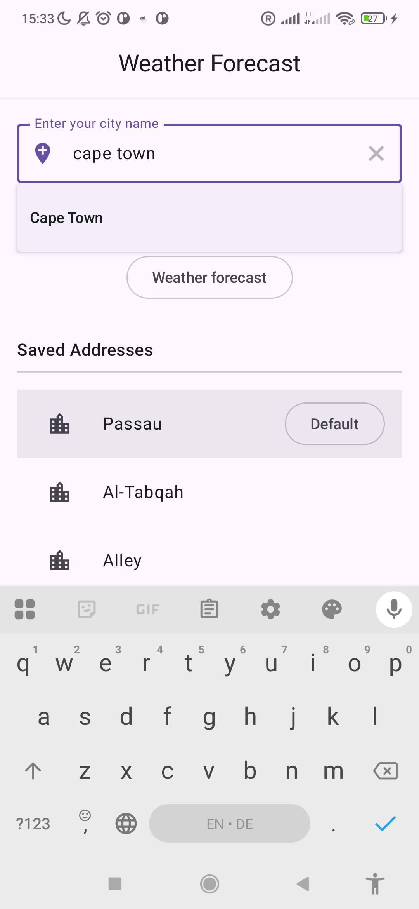   |  | 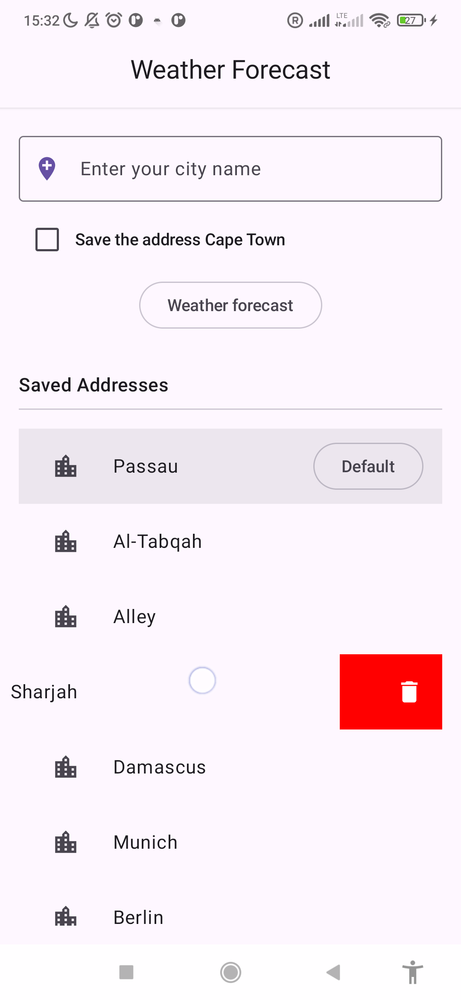   | 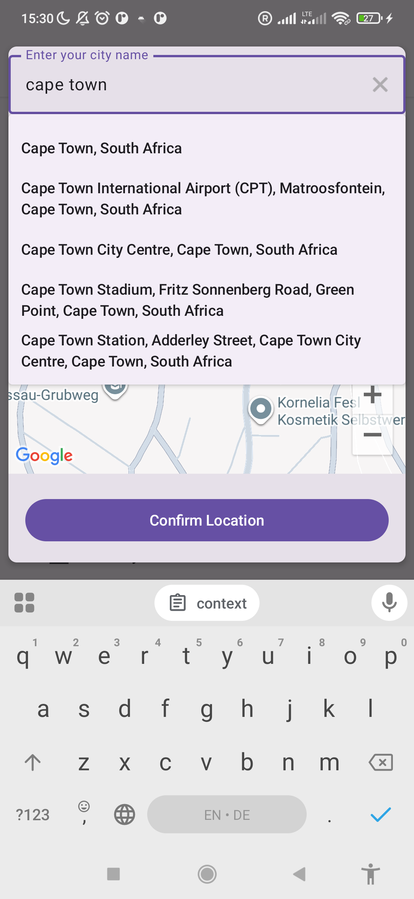 |


|           Search (Place API)           |    Select location (weather api)    |                Cloudy                 |                 Snowy                 |
|:--------------------------------------:|:-----------------------------------:|:-------------------------------------:|:-------------------------------------:|
|  | 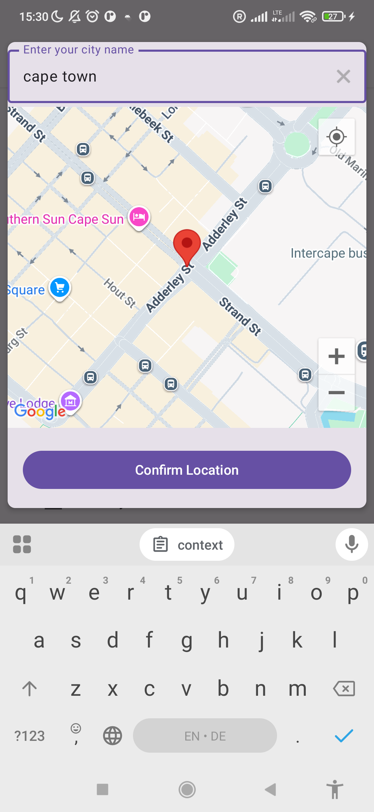 | 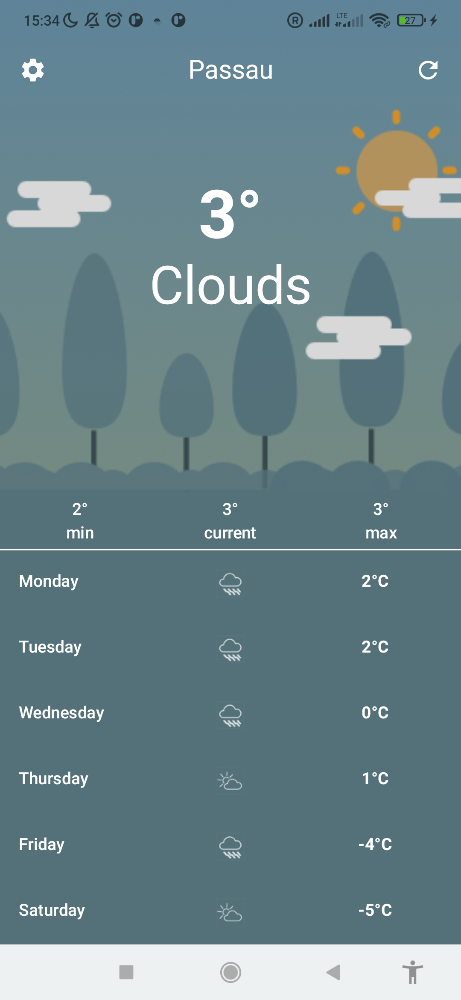 | 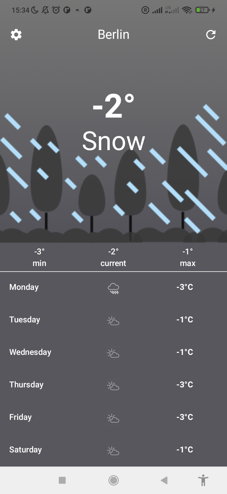 |


|               Settings                |               Themes                |               Languages                |             Notifications             |
|:--------------------------------------:|:-----------------------------------:|:-------------------------------------:|:-------------------------------------:|
|  | 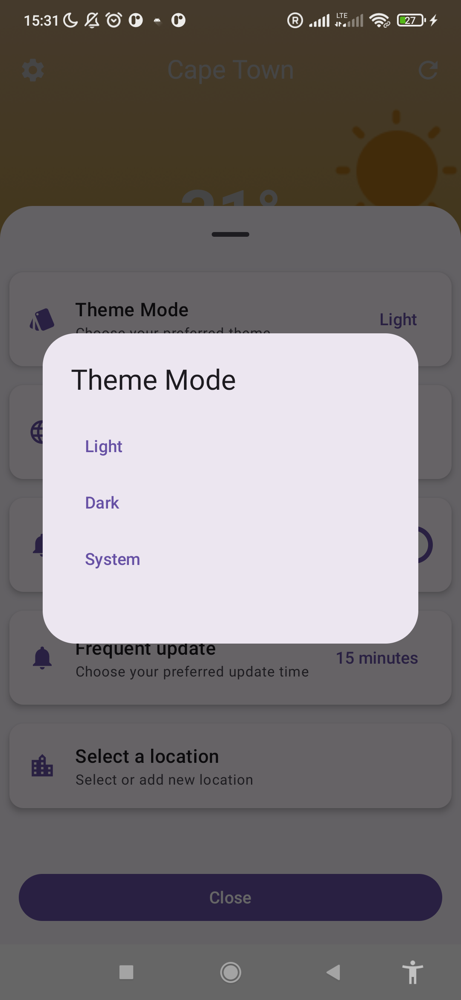 | 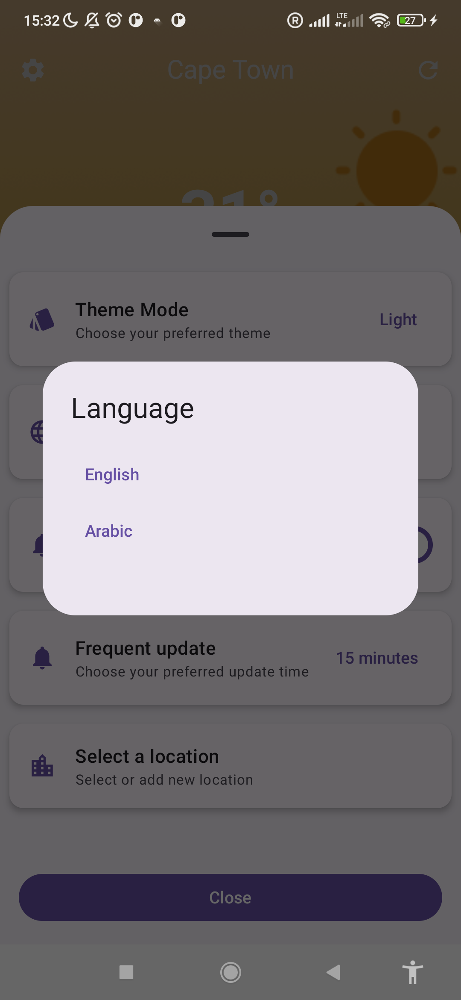 | 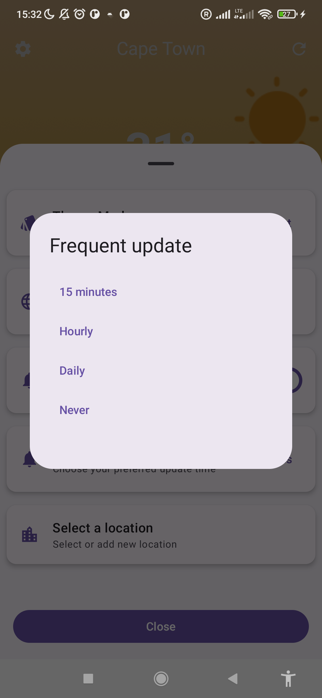 |


|               Dark mode                |              Settings               |            Arabic language            |               Settings                |
|:--------------------------------------:|:-----------------------------------:|:-------------------------------------:|:-------------------------------------:|
| 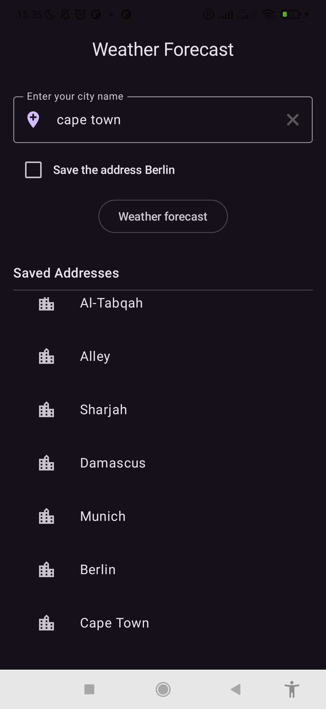 | 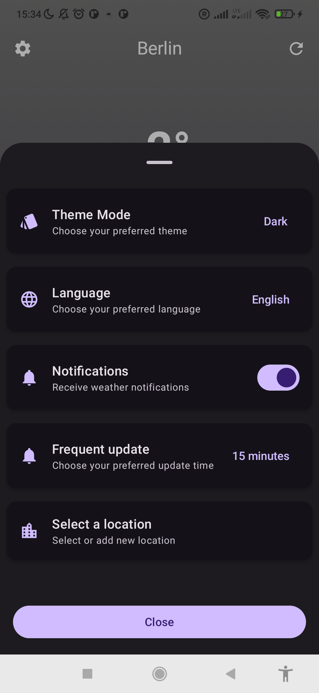 | 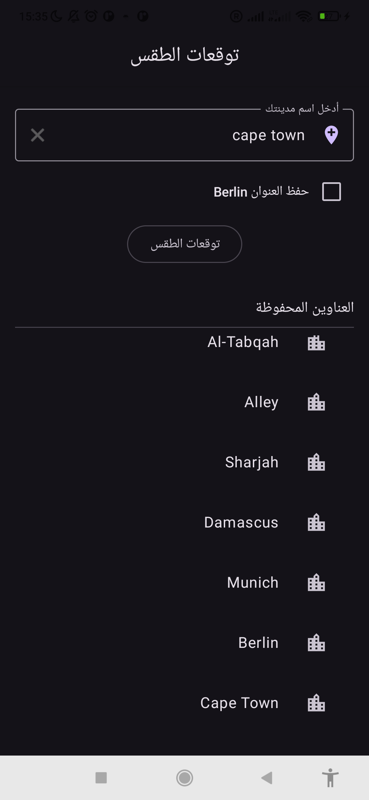 | 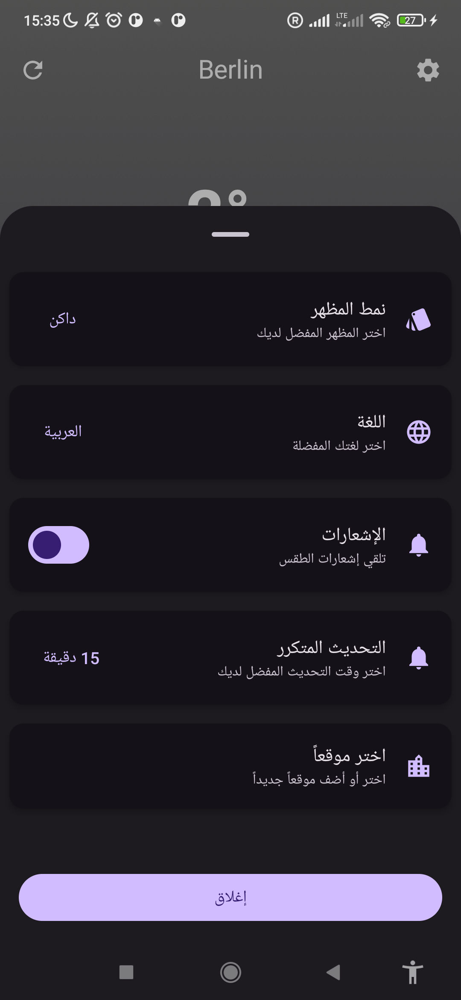 |


|                                    Dashboard                                     |                                    Search                                     |                                    Forecast                                     |
|:--------------------------------------------------------------------------------:|:-----------------------------------------------------------------------------:|:-------------------------------------------------------------------------------:|
|  |  |  |

---

## CI/CD & Automation

This project utilizes **GitHub Actions** for continuous integration and delivery. Our automated pipeline ensures code quality and provides ready-to-use build artifacts.

- **Workflow Configuration**: **[build-android.yml](.github/workflows/build-android.yml)**
- **Latest Pipeline Run**: **[View Workflow Run #20938179350](https://github.com/adhamkhwaldeh/WeatherSdk/actions/runs/20938179350)**

### Build Artifacts

From each successful pipeline run, the following artifacts are exported:

- 📦 **[Download Sample APK](https://github.com/adhamkhwaldeh/WeatherSdk/actions/runs/20938179350/artifacts/5105218708)**: Direct link to the latest generated application.
- 📚 **[Download Dokka Documentation](https://github.com/adhamkhwaldeh/WeatherSdk/actions/runs/20938179350/artifacts/5105156616)**: Full technical API reference generated automatically.

---

## Quality Assurance & Testing

This project adheres to high-quality code standards and rigorous testing practices, all automated via **GitHub Actions**:

- **Continuous Integration**: A full **GitHub Pipeline** is configured to run tests, linting, and documentation checks on every push and pull request.
- **Static Analysis**: Configured with **detekt** for code smells and **ktlint** for consistent code formatting.
- **Architectural Linting**: Uses **Konsist** to enforce architectural rules and project structure. Check out our **[KonsistTest.kt](./WeatherSDK/src/test/java/com/adham/weatherSdk/KonsistTest.kt)** for specific rules (e.g., ViewModel naming, domain layer isolation, and immutable DTOs).
- **Documentation**: Fully documented using **KDoc** syntax, with **Dokka** used to generate professional HTML API references.
- **Testing Strategy**:
  - **Unit Tests**: Comprehensive testing of business logic and UseCases. Key tests include **[CurrentWeatherUseCaseTest.kt](./WeatherSDK/src/test/java/com/adham/weatherSdk/useCases/CurrentWeatherUseCaseTest.kt)** and **[ForecastWeatherUseCaseTest.kt](./WeatherSDK/src/test/java/com/adham/weatherSdk/useCases/ForecastWeatherUseCaseTest.kt)**.
  - **UI Testing**: Automated Compose UI tests to ensure seamless user interactions. Our primary end-to-end validation is found in **[End2EndSuccessTesting.kt](./app/src/androidTest/java/com/adham/weatherSample/End2EndSuccessTesting.kt)**.

---

## Support & Resources

- **API Reference**: [Weatherbit.io](https://www.weatherbit.io)
- **Issues & Support**: [GitHub Issues](https://github.com/adhamkhwaldeh/WeatherSdk/issues)
