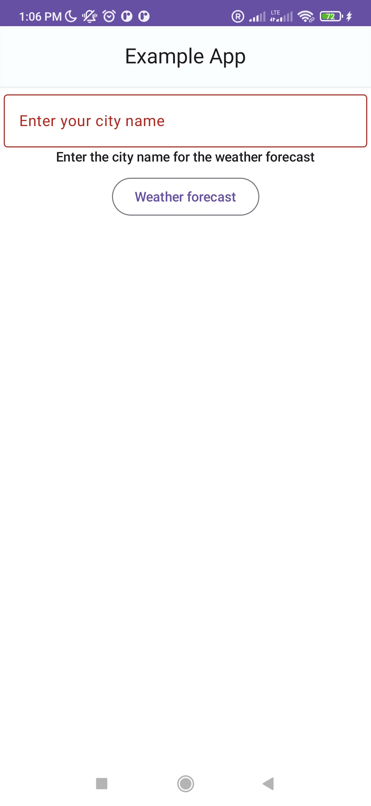
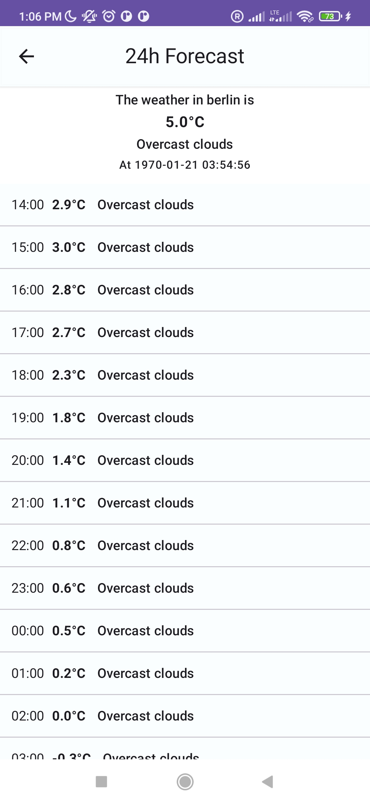

# WeatherSDK Project

A modular Android project providing a comprehensive Weather SDK and a sample application. Built with Jetpack Compose, Koin, Coroutines, and a clean, state-driven architecture.

## Project Structure

The project is divided into three main modules:
- **[WeatherSDK](./WeatherSDK/README.md)**: The core library for fetching weather and forecast data.
- **[CommonSDK](./CommonSDK/README.md)**: Foundational logic for building standardized SDKs (Lifecycle, Logging, Error handling).
- **[CommonLibrary](./CommonLibrary/README.md)**: Shared UI components, base classes, and state management (`BaseState`).

---

## Installation

Add the following dependencies to your `build.gradle` file (using JitPack):

```gradle
dependencies {
    implementation 'com.github.adhamkhwaldeh.WeatherSdk:WeatherSDK:1.0.7'
    implementation 'com.github.adhamkhwaldeh.WeatherSdk:CommonSDK:1.0.7'
    implementation 'com.github.adhamkhwaldeh.WeatherSdk:CommonLibrary:1.0.7'
}
```

---

## Setup & Configuration

### Step 1: Initialize the SDK
Configure the SDK in your `Application` class or DI module using the `Builder` pattern:

```kotlin
val weatherSDK = WeatherSDK.Builder(context, "YOUR_API_KEY")
    .setupOptions(
        WeatherSDKOptions.Builder("YOUR_API_KEY")
            .setLogLevel(LogLevel.DEBUG)
            .build()
    )
    .build()
```

### Step 2: Dependency Injection (Koin)
The project uses modern Koin DSL. Register your ViewModels using `viewModelOf`:

```kotlin
val viewModelsModule = module {
    viewModelOf(::WeatherViewModel)
}
```

---

## Quality Assurance & Testing

This project adheres to high-quality code standards and rigorous testing practices, all automated via **GitHub Actions**:

- **Continuous Integration**: A full **GitHub Pipeline** is configured to run tests, linting, and documentation checks on every push and pull request.
- **Static Analysis**: Configured with **detekt** for code smells and **ktlint** for consistent code formatting.
- **Architectural Linting**: Uses **Konsist** to enforce architectural rules and project structure. Check out our **[KonsistTest.kt](./WeatherSDK/src/test/java/com/adham/weatherSdk/KonsistTest.kt)** for specific rules (e.g., ViewModel naming, domain layer isolation, and immutable DTOs).
- **Documentation**: Fully documented using **KDoc** syntax, with **Dokka** used to generate professional HTML API references.
- **Testing Strategy**:
    - **Unit Tests**: Comprehensive testing of business logic and UseCases. Key tests include **[CurrentWeatherUseCaseTest.kt](./WeatherSDK/src/test/java/com/adham/weatherSdk/useCases/CurrentWeatherUseCaseTest.kt)** and **[ForecastWeatherUseCaseTest.kt](./WeatherSDK/src/test/java/com/adham/weatherSdk/useCases/ForecastWeatherUseCaseTest.kt)**.
    - **UI Testing**: Automated Compose UI tests to ensure seamless user interactions. Our primary end-to-end validation is found in **[End2EndSuccessTesting.kt](./app/src/androidTest/java/com/adham/weatherSample/End2EndSuccessTesting.kt)**.

Run all checks locally using:
```bash
./gradlew check
./gradlew dokkaHtml
```

---

## Usage Example

### Navigation and SDK Status
Observe the `sdkStatus` to handle navigation between the city selection and forecast screens:

```kotlin
val sdkStatus by weatherSDK.sdkStatus.observeAsState()

LaunchedEffect(sdkStatus) {
    when (val current = sdkStatus) {
        is WeatherSdkStatus.OnLaunchForecast -> {
            navController.navigate("forecast/${current.cityName}")
        }
        is WeatherSdkStatus.OnFinish -> {
            navController.popBackStack()
        }
        else -> Unit
    }
}
```

---

## Demo & Screenshots

### Application Preview

|                                      Dashboard                                      | Search | Forecast |
|:-----------------------------------------------------------------------------------:| :---: | :---: |
|  |  |  |

---

## Support & Resources

- **API Reference**: [Weatherbit.io](https://www.weatherbit.io)
- **Issues & Support**: [GitHub Issues](https://github.com/adhamkhwaldeh/WeatherSdk/issues)
- **Documentation**: Technical API docs can be generated per module using `./gradlew dokkaHtml`.
